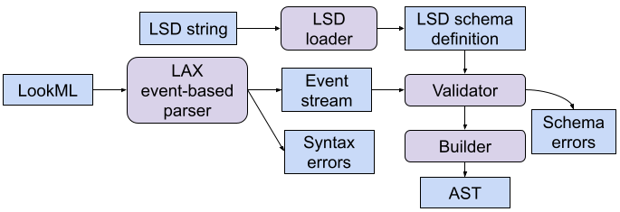

<!--

Licensed to the LookML Authors under one or more contributor
license agreements.  See the NOTICE file distributed with this
work for additional information regarding copyright ownership.
The LookML Authors license this file to you under the Apache
License, Version 2.0 (the "License"); you may not use this
file except in compliance with the License.  You may obtain a
copy of the License at

http://www.apache.org/licenses/LICENSE-2.0

Unless required by applicable law or agreed to in writing,
software distributed under the License is distributed on an
"AS IS" BASIS, WITHOUT WARRANTIES OR CONDITIONS OF ANY KIND,
either express or implied.  See the License for the specific
language governing permissions and limitations under the
License.

-->
[](https://github.com/hydromatic/lookml/actions?query=branch%3Amain)
[](https://maven-badges.herokuapp.com/maven-central/net.hydromatic/lookml)
[](https://javadoc.io/doc/net.hydromatic/lookml)

# LookML

Compiler toolchain for the LookML language.

## What is LookML?

LookML is a language devised by [Looker](https://cloud.google.com/looker)
for representing Business Intelligence (BI) models. A Looker BI model
consists of objects whose types include `explore`, `view`, `dimension`, and
`measure`; using a BI model, you can easily build complex visualizations, and
Looker will generate queries in SQL.

### Syntactic LookML

At the heart of LookML is a basic syntax called **Syntactic LookML**.
Here is an example:
```
# Description of the Beatles in Syntactic LookML.
band: beatles {
  founded: 1962
  origin: "Liverpool"
  member: paul {
    instruments: ["bass", "guitar", "vocal"]
  }
  member: john {
    instruments: ["guitar", "vocal", "harmonica"]
    lyric: Living is easy with eyes closed
      Misunderstanding all you see
      It's getting hard to be someone, but it all works out
      It doesn't matter much to me ;;
  }
  member: george {
    instruments: ["guitar", "vocal"]
  }
  member: ringo {
    instruments: ["drums", "vocal"]
  }
}
```

This LookML is **well-formed** because it follows basic syntactic rules such as
that each open brace `{` is matched with a close brace `}`. But with types such
as `band` and `member` it clearly does not follow Looker's schema. That's
because Syntactic LookML has no schema!

(Later, we'll see how you can define a schema, and check it using a schema
validator. Separating out the schema keeps the language simple, the parser
efficient, and lets you easily define your own dialect of LookML.)

Here is the syntax of Syntactic LookML in BNF:
```
start
    : property
    ;

properties
    : property
    | properties property
    |
    ;

property
    : IDENTIFIER COLON value
    | IDENTIFIER COLON IDENTIFIER object
    | IDENTIFIER COLON object
    | CODE_IDENTIFIER COLON code DOUBLE_SEMI_COLON
    ;

value
    : STRING
    | NUMBER
    | IDENTIFIER
    | list
    ;

object
    : OPEN_BRACE properties CLOSE_BRACE
    ;

list
    : OPEN_BRACKET CLOSE_BRACKET
    | OPEN_BRACKET listItems CLOSE_BRACKET
    | OPEN_BRACKET listItems COMMA CLOSE_BRACKET
    ;

listItems
    : listItems COMMA listItem
    | listItem
    ;

listItem
    : value COLON value
    | value
```

So:
 * `# Description of the Beatles in Syntactic LookML.` is a *comment*;
 * `"Liverpool"` is a *string value*;
 * `1962` is *number value*;
 * `["drums", "vocal"]` is a *list value*;
 * `founded: 1962` is a *number property*;
 * `lyric: Living is easy` ... `;;` is a *code property*;
 * `member: ringo { instrument: ["guitar", "vocal"] }`
   is a *named-object property*.
 * `band: beatles {` ... `}` is also a named-object property,
   and also the *root property*.

Technically there are *property definitions* and *property instances*,
but we can use the word *property* for either, as long as it is clear.
For example, `instruments` is the name of a property definition (there
is one definition, and it lives in the schema), and
`instruments: ["drums", "vocal"]` is one of four instances of the
`instruments` property in the document.

`founded`, `member`, `lyric`, and `band` are also property
definitions.
 * `lyric` is a code property. It is therefore registered with the
   parser as a `CODE_IDENTIFIER`, which causes the parser to go into
   a special state, chewing up all text until it reaches a `;;`.
 * `band` is the root property of the document. In LookML, the root
   property must be a named object.

`ringo` is an object name. Usually you can only have one instance of each
property type in an object. But a named-object property can have more than one
instance, as long as the names are unique.

## Parser and object model

`LaxParser` provides a push-based parser for Syntactic LookML.
To call it, you supply a string and an `ObjectHandler`.
The parser will call the appropriate method for each element of the document.

<!-- LaxTest.testParseReadmeExample() is a clone of the following example.
     Please keep it up to date. -->

For example,
```
String code =
    "band: beatles {\n"
      + "  founded: 1962\n" // ... rest as above
      + "}";
ObjectHandler h =
    new ObjectHandler() {
      @Override public ObjectHandler code(String propertyName, String value) {
        if (propertyName.equals("lyric")) {
          System.out.println(value);
        }
        return this;
      }
    };
LookmlParsers.parse(h,
    LookmlParsers.config()
        .withCodePropertyNames(Collections.singleton("lyric"))
        .withSource(Sources.fromString(code)));
```
prints
```
Living is easy with eyes closed
Misunderstanding all you see
It's getting hard to be someone, but it all works out
It doesn't matter much to me
```

## Object model

The compiler toolchain is organized into an object model
so that you can easily create and reuse components.

The following diagram shows how those components are composed
into a typical toolchain.



The *LAX event-based parser* reads a LookML string and generates a
stream of events (and possibly syntax errors).
The *validator* checks that the events conform to a particular dialect
of LookML (as defined by a *LSD schema definition*) and outputs a
stream of validated events (and possibly schema errors).
The *builder* receives a stream of validated events and converts them
into an abstract syntax tree (*AST*).

Key interfaces:
* `interface LookmlSchema` represents an *LSD schema definition*
  and defines what properties are valid for a particular dialect
  of LookML;
* `interface ObjectHandler` is an object that can receive
  an *event stream*;
* `interface PropertyHandler` is an object that can receive
  a stream of validated events. (These are similar to
  the events received by `ObjectHandler`, but each property
  has been assigned a type.)

One way to create a schema is to write a LookML schema file
and use the *LSD loader* to convert it into an instance of
`LookmlSchema`; you can also (not shown in the diagram)
create a schema directly using `LookmlSchemas.builder()`.

## Get LookML

### From Maven

Get LookML from
<a href="https://search.maven.org/#search%7Cga%7C1%7Ca%3Alookml">Maven central</a>:

```xml
<dependency>
  <groupId>net.hydromatic</groupId>
  <artifactId>lookml</artifactId>
  <version>0.1</version>
</dependency>
```

### Download and build

You need Java (8 or higher) and Git.

```bash
$ git clone git://github.com/hydromatic/lookml.git
$ cd lookml
$ ./mvnw clean verify
```

On Windows, the last line is

```bash
> mvnw clean verify
```

On Java versions less than 11, you should add parameters
`-Dcheckstyle.version=9.3`.

## More information

* License: <a href="LICENSE">Apache License, Version 2.0</a>
* Author: Julian Hyde
* Source code: https://github.com/hydromatic/lookml
* Issues: https://github.com/hydromatic/lookml/issues
* <a href="HISTORY.md">Release notes and history</a>
* <a href="HOWTO.md">HOWTO</a>
